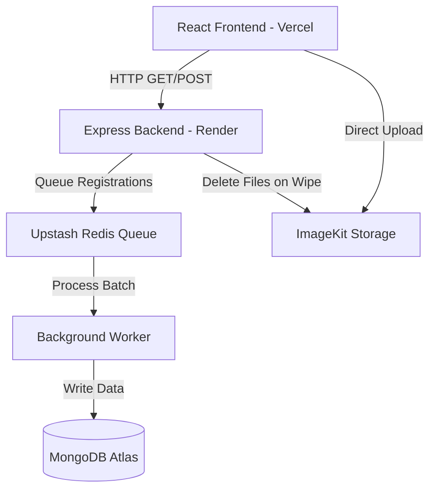

# System Design & Architecture 🏗️

The MECHAPEF-Website is designed to be highly scalable on the free tier, specifically optimized for event registration traffic spikes (e.g., 800+ concurrent requests).

## High-Level Architecture

## Scalability Implementations (Free Tier Optimizations)

### 1. Smart Queuing with BullMQ & Redis
- **Problem:** When 800 students register simultaneously, MongoDB connection pools get exhausted, causing timeouts and 502 Bad Gateway errors.
- **Solution:** The backend intercepts `POST /api/events/:id/register` and pushes the payload into a Redis Queue instantly (1ms). The server responds with `202 Accepted`. A background worker fetches 10 items at a time and writes to MongoDB without crashing the server.

### 2. Render Cold Start Mitigation
- **Problem:** Render's free tier spins down the server after 15 minutes of inactivity. The first person to visit after 15 minutes faces a 50-second load time, and multiple early visitors could crash the booting server.
- **Solution:** A dynamic cron-job inside `backend/src/utils/cron.js` checks the database for events scheduled for *today*. If an event is active today, the backend sends a `/api/health` ping to itself every 10 minutes to stay awake and warm.

### 3. Graceful UI Degradation
- **Problem:** Unhandled 5xx errors look unprofessional and cause panic clicking.
- **Solution:** Global Axios interceptors in the React app automatically detect 502/503/504 errors and network disconnects, replacing standard crashes with an elegant "Heavy traffic, please wait..." toast message.

### 4. Storage Conservation (Wipe Data Mechanism)
- **Problem:** Students upload heavy screenshots for payments or verifications. After the event, these files eat up the ImageKit storage limit.
- **Solution:** The Admin Panel has a "Wipe Data" (🧹) button. It preserves the statistical count (total registrations) but deletes the physical files from ImageKit and clears the large `customData` strings from MongoDB.

## Data Models
- **User:** Stores profile details, roles, session tracking, and an array of `participatedEventNames`.
- **Event:** Stores event configurations, custom dynamic form schema, and current stats.
- **Registration:** Represents the M:N relationship between User and Event, containing the dynamic user inputs (`customData`) and ticket status.
